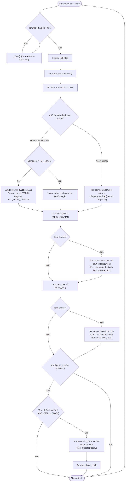
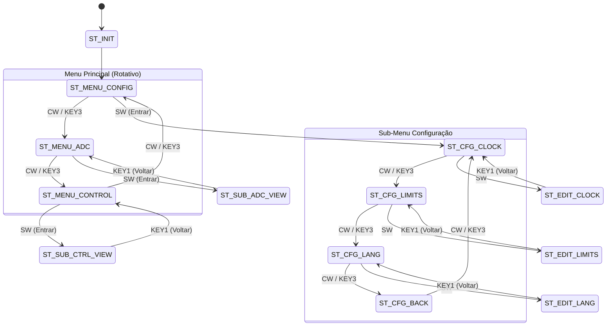

# Central de Alarme Embarcada — LPC11U14 (ARM Cortex-M0)

Um sistema embarcado completo de **Central de Alarme e Monitoramento** desenvolvido em **C** para o microcontrolador **NXP LPC11U14 (ARM Cortex-M0 @ 48 MHz)**.

O projeto utiliza uma **Arquitetura Orientada a Eventos com Máquina de Estados Finita (ESM)**, temporização determinística por **SysTick**, modos de baixo consumo de energia (`__WFI`), display LCD com buffer anti-flicker e persistência de dados em EEPROM externa via barramento I2C.

---

## Recursos e Funcionalidades

- **Kernel ESM (Embedded State Machine)**:
  - Arquitetura orientada a tabela de transição por handlers.
  - Pilha de navegação hierárquica (`NavState_t`) permitindo navegação profunda e retorno pelo botão `BACK`.
- **Interface Homem-Máquina (IHM)**:
  - Display LCD 16x2 em modo 4 bits com suporte a **múltiplos idiomas (Português / Inglês)**.
  - Técnica **Anti-Flicker**: montagem de tela em buffer RAM (`lbuf[2][17]`) com escrita direta por _overwrite_.
  - Navegação por **Encoder Rotativo (decodificação de quadratura por tabela Gray Code)** e teclado de 3 teclas físicas.
- **Leitura Analógica e Alarme Latching**:
  - Monitoramento contínuo do ADC com limites configuráveis (Superior e Inferior).
  - Alarme com travamento (_latching_) ativando **Buzzer via PWM (CT32B0_MAT0)** e **LED indicador**.
- **Persistência de Dados (EEPROM 24LC512 via I2C)**:
  - Armazenamento de preferências (Idioma, Limites Hi/Lo, estado de armação).
  - **Registro de Eventos (Logs Circular)**: grava histórico dos últimos alarmes (timestamp, valor ADC e tipo de disparo).
  - Gravação condicional por byte (_dirty write check_) para preservação da vida útil da memória.
- **Telemetria e Controle Serial (UART 9600 8N1)**:
  - Parser de comandos seriais com verificação de enquadramento (`<` e `>`).
  - Relatório completo de diagnóstico e telemetria do sistema.
- **Segurança e Proteção de Energia (BOD — Brown-Out Detect)**:
  - Interrupção de hardware para queda de tensão: desativa atuadores para economizar carga e executa **salvamento emergencial** na EEPROM antes do shutdown.

---

## Arquitetura de Software

### Diagrama de Arquitetura do Sistema



### Diagrama de Estados (Navegação IHM)



---

## Mapeamento de Hardware / Periféricos

| Periférico         | Pino LPC11U14                     | Função / Descrição                     |
| :----------------- | :-------------------------------- | :------------------------------------- |
| **LCD RS**         | `PIO1_31`                         | Sinal de controle RS do LCD            |
| **LCD EN**         | `PIO1_28`                         | Sinal de Enable do LCD                 |
| **LCD Data**       | `PIO1_19`..`PIO1_22`              | Barramento de dados 4-bits (D4..D7)    |
| **Encoder A/B**    | `PIO1_13` / `PIO1_14`             | Canais de quadratura do Encoder        |
| **Encoder SW**     | `PIO1_15`                         | Botão push-button do Encoder           |
| **Teclas 1, 2, 3** | `PIO1_25` / `PIO1_26` / `PIO1_27` | Teclas físicas (Back, Up, Down)        |
| **I2C SDA / SCL**  | `PIO0_5` / `PIO0_4`               | Barramento I2C (EEPROM 24LC512 @ 0x50) |
| **Sensor ADC**     | `PIO0_11` (AD0)                   | Entrada Analógica                      |
| **Buzzer PWM**     | `PIO0_18` (CT32B0_MAT0)           | Saída PWM 1 kHz para buzzer            |
| **LED Indicador**  | `PIO1_24` (LED0)                  | Sinalizador visual de alarme           |
| **UART RX / TX**   | `PIO0_18` / `PIO0_19`             | Comunicação serial 9600 8N1            |

---

## Comandos Seriais (UART)

Os comandos devem ser enviados entre os delimitadores `<` e `>`:

| Comando     | Descrição                                   | Exemplo     |
| :---------- | :------------------------------------------ | :---------- |
| `<L1>`      | Arma o sistema de alarme                    | `<L1>`      |
| `<L0>`      | Desarma o sistema de alarme                 | `<L0>`      |
| `<VAAxxxx>` | Define o limite superior (Hi) do ADC        | `<VAA0800>` |
| `<VABxxxx>` | Define o limite inferior (Lo) do ADC        | `<VAB0200>` |
| `<IDIPT>`   | Altera idioma do sistema para Português     | `<IDIPT>`   |
| `<IDIEN>`   | Altera idioma do sistema para Inglês        | `<IDIEN>`   |
| `<STATUS>`  | Retorna relatório de telemetria e validação | `<STATUS>`  |

---

## Estrutura de Arquivos do Projeto

```
base_lpc11u14/
├── docs/
│   └── diagrams/        # Diagramas e documentação gráfica do projeto
├── src/
│   ├── main.c           # Super-loop principal e inicialização
│   ├── stateMachine.c/h # Kernel ESM e gerenciamento de transições
│   ├── display.c/h      # Driver de IHM e montagem de telas (PT/EN)
│   ├── var.c/h          # Gestão de variáveis persistentes na EEPROM
│   ├── alarm.c/h        # Lógica de controle do alarme e atuadores
│   ├── serialCmd.c/h    # Parser de pacotes e comandos seriais
│   ├── inputs.c/h       # Debounce de teclas e decodificação do encoder
│   ├── eeprom_24lc512.c/h # Driver de memória EEPROM I2C
│   ├── i2c.c/h          # Driver do periférico I2C mestre
│   ├── lcd.c/h          # Driver para display HD44780 em modo 4 bits
│   ├── adc.c/h          # Driver do conversor ADC (10-bit)
│   ├── pwm.c/h          # Driver do temporizador PWM (CT32B0)
│   ├── bod.c/h          # Tratador de interrupção Brown-Out Detect
│   └── serial.c/h       # Driver UART baixo nível
├── README.md
└── .gitignore
```

---

## Como Compilar

1. Abra o projeto no ambiente **MCUXpresso IDE** ou **Keil uVision**.
2. Garanta que o toolchain **ARM GCC** esteja configurado para a família **LPC11Uxx**.
3. Realize o Build do projeto (`Ctrl+B`).
4. Conecte a placa via gravador SWD (ex: LPC-Link2, Segger J-Link) e faça o flash da aplicação.

---

## Licença

Este projeto é disponibilizado sob a licença [MIT](https://opensource.org/licenses/MIT). Sinta-se à vontade para utilizar, estudar e modificar.
